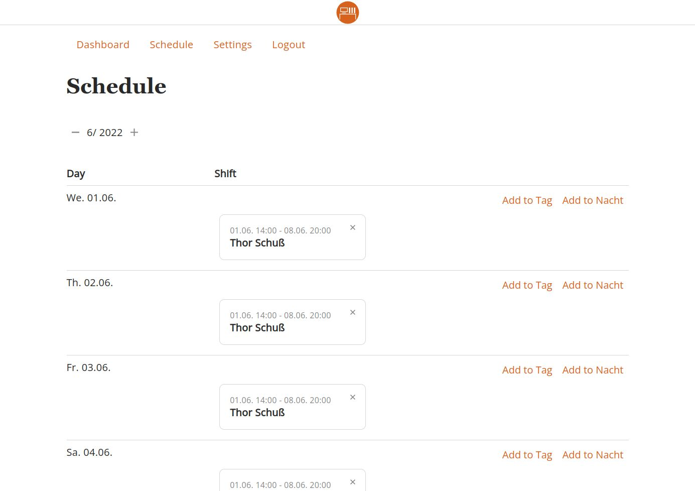

# baldeweg/desk_shift

Shift planer for on-call duty, that is able to set a phone number automatically as a forwarding destination.

## Repositories

- storage <https://github.com/abaldeweg/desk_storage> - Backend
- shift <https://github.com/abaldeweg/desk_shift> - UI

## Requirements

- NodeJS 14
- Docker

## Get Started

Clone the projects from the git repository and start the container. For an update, check out the new files from the git repository and restart the container.

## Env vars

- VUE_APP_API - URL to the backend
- VUE_APP_I18N_LOCALE - The locale e.g. `en-US`
- VUE_APP_BASE_URL - The Base URL, in case the app is installed in a subdirectory
- VUE_APP_API_KEY - Api key for auth (GCP Identity Platform)
- VUE_APP_AUTH_DOMAIN - Domain to authenticate against (GCP Identity Platform)

## Architecture

All Code needs to be checked. For that Linter, CI-Tools, Unit-Tests and E2E-Tests should be in place. Security Alerts for dependencies should be active and Best Practices for coding needs to be followed. As framework was chosen VueJS because of the free license and wide spread. The resulting code should also be released under a free license.
